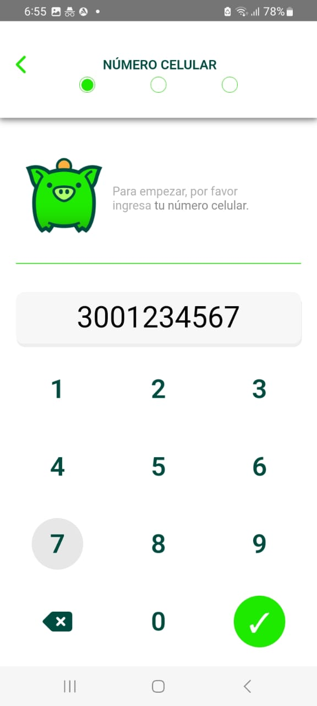
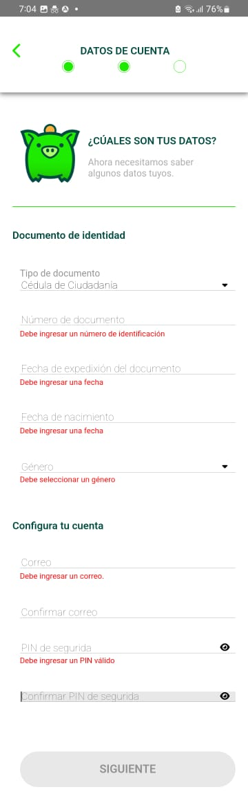

# Prueba Desarrollador Ionic - Angular

El objetivo de la presente prueba es desarrollar una aplicación en Ionic utilizando la API de Coink
donde se pueda simular un registro exitoso en Coink.

La aplicación debería contar con lo siguiente:

1. Desarrollar la siguiente interfaz para la aplicación:

   https://xd.adobe.com/view/2e4efd9b-575d-4d3d-9753-0fbb3eb3e2f9-7b1d/

2. El usuario debe ser capaz de navegar entre pantallas solamente cuando los datos
   introducidos por el usuario son validos.
3. Todos los campos de entrada deben validar los datos introducidos por el usuario y
   mostrar mensajes de error útiles para entradas incorrectas.
4. Implementar un Spinner o Loader para el llamado de los servicios.
5. Recolecte los datos del usuario registrados en todo el flujo y muéstrelos en un log
   cuando finalice el registro.

Se evaluará:

- Calidad a nivel de código.
- Patrones de diseño.
- Uso de estilos y componentes visuales.
  Consideraciones:
- Manejar errores inesperados.
  Los endpoints que deben ser integrados son los siguientes:
- https://api.bancoink.biz/qa/signup/documentTypes?apiKey=030106
- https://api.bancoink.biz/qa/signup/genders?apiKey=030106

## Solución

Esta aplicación está desarrollada utilizando Angular versión 16.2.12 y Node.js versión 20.9.0.

### Ejecución de la Aplicación

Para ejecutar la aplicación localmente, sigue estos pasos:

1. Clona el repositorio de Git:

   git clone [https://github.com/mfquinonesc/CoinkAngularIonic.git](https://github.com/mfquinonesc/CoinkAngularIonic.git)

2. Navega al directorio del proyecto y ejecuta el siguiente comando para instalar las dependencias:

    ```
    npm install 
    ```

3. Inicia el servidor de desarrollo con el comando:

    ```
    ng serve -o 
    ```
    Este comando abrirá automáticamente la aplicación en tu navegador predeterminado [http://localhost:4200/](http://localhost:4200/)

### Construcción del Build para Android

Para construir el proyecto y prepararlo para Android, sigue estos pasos:

1. Ejecuta el siguiente comando para generar el build de Angular:

    ```
    ng build
    ```

2. Después de construir el proyecto con Angular, sincroniza los cambios con Capacitor ejecutando el siguiente comando:

    ```
    npx cap sync
    ```

3. Se abre Android Studio (asegúrate de tenerlo preinstalado) ejecutando el siguiente comando:

    ```
    npx cap open android
    ```

4. Esto abrirá Android Studio con tu proyecto.

5. En Android Studio, ve al menú "Build", luego selecciona "Build Bundles/APKs" y finalmente haz clic en "Build APK(s)". Una vez que se complete la construcción del APK, podrás encontrarlo en la carpeta donde está configurado para ser guardado.

    


Otra opción sería ejecutar el comando (Opcional porque depende de Java)

    ```
    npx cap run android
    ```

### Capturas de pantallas

 




<hr> 


<hr>




